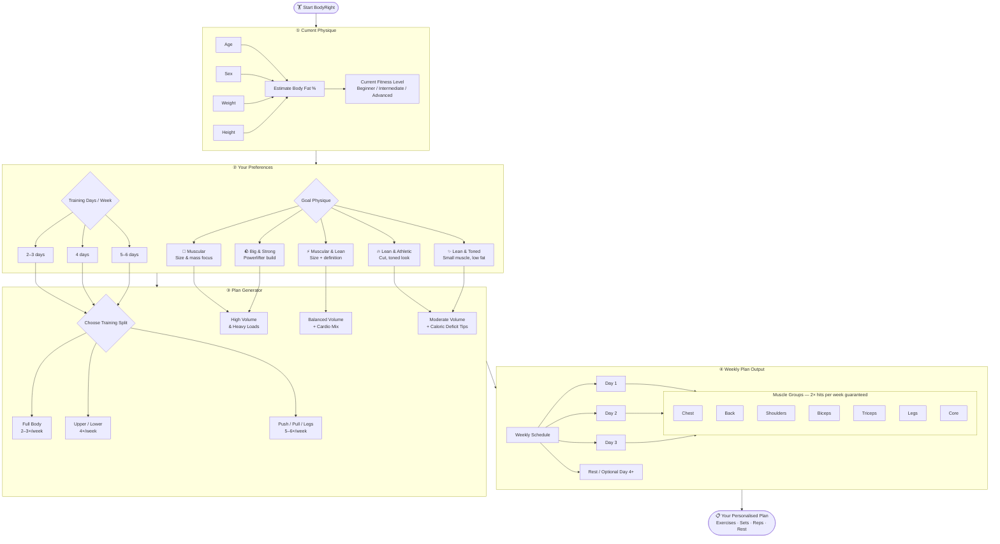

# BodyRight — App Flow Diagram

```mermaid
flowchart TD
    START([🏋️ Start BodyRight]) --> PROFILE

    subgraph PROFILE["① Current Physique"]
        P1[Age] & P2[Sex] & P3[Weight] & P4[Height] --> P5[Estimate Body Fat %]
        P5 --> P6[Current Fitness Level\nBeginner / Intermediate / Advanced]
    end

    PROFILE --> GOALS

    subgraph GOALS["② Your Preferences"]
        G1{Goal Physique}
        G1 --> GA[💪 Muscular\nSize & mass focus]
        G1 --> GB[⚡ Muscular & Lean\nSize + definition]
        G1 --> GC[🔥 Lean & Athletic\nCut, toned look]
        G1 --> GD[🪨 Big & Strong\nPowerlifter build]
        G1 --> GE[✨ Lean & Toned\nSmall muscle, low fat]

        FREQ{Training Days / Week}
        FREQ --> F2[2–3 days]
        FREQ --> F3[4 days]
        FREQ --> F4[5–6 days]
    end

    GOALS --> ENGINE

    subgraph ENGINE["③ Plan Generator"]
        direction TB
        SPLIT{Choose Training Split}

        F2 --> SPLIT
        F3 --> SPLIT
        F4 --> SPLIT

        SPLIT --> S1[Full Body\n2–3×/week]
        SPLIT --> S2[Upper / Lower\n4×/week]
        SPLIT --> S3[Push / Pull / Legs\n5–6×/week]

        GA & GD --> VOL[High Volume\n& Heavy Loads]
        GB --> BAL[Balanced Volume\n+ Cardio Mix]
        GC & GE --> LEAN[Moderate Volume\n+ Caloric Deficit Tips]
    end

    ENGINE --> PLAN

    subgraph PLAN["④ Weekly Plan Output"]
        direction LR
        WK[Weekly Schedule] --> D1[Day 1]
        WK --> D2[Day 2]
        WK --> D3[Day 3]
        WK --> D4[Rest / Optional Day 4+]

        D1 & D2 & D3 --> MG

        subgraph MG["Muscle Groups — 2× hits per week guaranteed"]
            MG1[Chest] & MG2[Back] & MG3[Shoulders]
            MG4[Biceps] & MG5[Triceps] & MG6[Legs]
            MG7[Core]
        end
    end

    PLAN --> OUTPUT([📋 Your Personalised Plan\nExercises · Sets · Reps · Rest])
```
